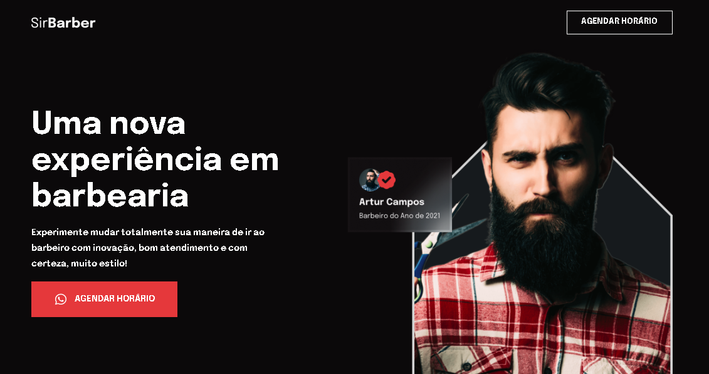

<br />
<p align="center">
  <h1 align="center">Maratona starter - Sirbarber</h1>

  <p align="center">
    Projeto criado à partir de um evento da CODAR.me, onde foi desenvolvido a landing page de uma barbearia. 
  </p>
  <br />
</p>


## Sobre o Projeto

<div align="center">
  <a href="https://mariferreiradev.github.io/maratona-starter">
    
  </a>
</div>

### Tecnologias Utilizadas

* HTML5 - Linguagem de marcação para a World Wide Web
* CSS3 - Usada para estilizar elementos escritos em uma linguagem de marcação como HTML

## Instalação

1. Clone o repositório
   ```sh
   git clone https://github.com/mariferreiradev/maratona-starter
   ```
2. Abra o index.html com um navegador


## Contato

Mariana Ferreira - [@mariferreiradev](https://www.linkedin.com/in/mariferreiradev/) - mariferreira.dev@gmail.com

Project Link: [https://github.com/mariferreiradev/maratona-starter](https://github.com/mariferreiradev/beauty-hair)
